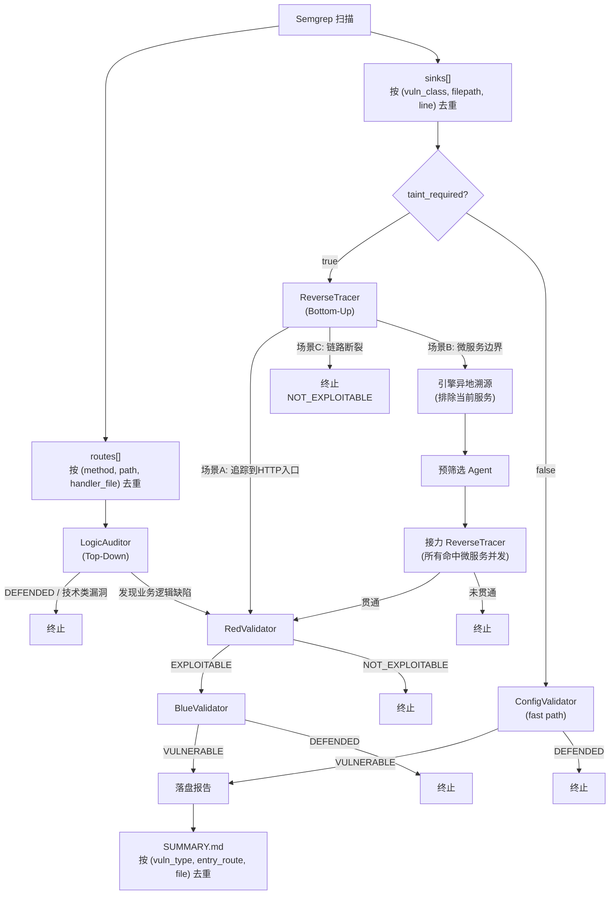

# CodeAudit 系统分析流程

## 全局流程

```
┌─────────────────────────────────────────────────────────────────────────┐
│                          引擎启动 (engine.run)                          │
│                                                                         │
│  1. 清理旧 .a2a_bus/ / .a2a_logs/ / reports/                           │
│  2. 重建 .a2a_bus/ 消息总线                                              │
│  3. 启动 Web 看板 (默认 8080，冲突自增)                                   │
│  4. _discover_microservices() 识别微服务                                 │
│  5. SemgrepScanner 扫描                                                 │
│  6. _dispatch_scan_results() 派发                                       │
│  7. 主循环: get_pending → process_task → 路由 → 重复直到空闲              │
│  8. 生成 SUMMARY.md (引用 vuln/*.md)                                       │
└─────────────────────────────────────────────────────────────────────────┘
```

## Semgrep 扫描 & 分流

```
SemgrepScanner.scan()
        │
        ├── routes[]  ──────── 按 (method, path, handler_file) 去重
        │
        └── sinks[]   ──────── 按 (vuln_class, filepath, line) 去重
              │
              ├── taint_required = true  (注入/反序列化/SSRF/XXE/命令注入等)
              │     └── 派发 → ReverseTracer
              │
              └── taint_required = false (弱加密/弱随机/硬编码/不安全TLS/JWT None等)
                    └── 派发 → ConfigValidator (fast path)
```

## 双轨并行审查



## Agent 输出场景详解

### ReverseTracer (3 场景互斥)

| 场景 | 条件 | 输出 | 下游 |
|---|---|---|---|
| **A 成功追踪** | 追踪到 HTTP 外部入口 (`@RequestParam` 等) | `vuln_type` + `entry_route` + `call_chain` + `suspicion_reason` | → RedValidator |
| **B 跨界追踪** | 追踪到微服务边界 (`@KafkaListener` / `@FeignClient` / `RestTemplate`) | `action=cross_service_trace` + `protocol` + `target_identifier` | → 引擎异地溯源 |
| **C 链路断裂** | 污点被硬编码/枚举/固定配置赋值 | `status=NOT_EXPLOITABLE` + `break_reason`(≥20字符) | → 终止 |

### 跨界追踪流程 (场景 B 触发)

```
ReverseTracer 输出 action=cross_service_trace
        │
        ▼
engine._handle_cross_service_reinstantiation()
        │
        ├── 按 (protocol, target_identifier) 去重合并
        │     同 key 的并发请求共享一个 Future (in-flight coalescing)
        │
        ▼
engine._compute_cross_service_results()
        │
        ├── 1. 预筛选 Agent: 判断哪些微服务引用了 target_identifier
        │
        ├── 2. 在命中微服务中并发启动接力 ReverseTracer
        │     └── _run_relay_agent(service_dir, prompt, service_name)
        │           └── tracker.agent_start → agent.execute → tracker.agent_finish
        │
        └── 3. 收集结果: {service_name: parsed_result_or_None}
              │
              ▼
        命中的微服务 → 注入 VulnCandidate → RedValidator
        未命中的微服务 → 丢弃
```

### LogicAuditor (2 场景互斥)

| 场景 | 条件 | 输出 | 下游 |
|---|---|---|---|
| **发现缺陷** | 业务语义建模(Q1-Q4)后确认缺失归属校验/鉴权可绕/硬编码后门 | `vuln_type`(4类之一) + `entry_route` + `call_chain` + `suspicion_reason` | → RedValidator |
| **审计通过** | 无业务逻辑缺陷 或 发现技术类漏洞 | `status=DEFENDED` | → 终止 |

LogicAuditor 工作步骤:
1. 读取入口函数 + 类名/注释/URL
2. **业务语义建模** (Q1: 资源归属谁 / Q2: 身份标识 vs 资源标识 / Q3: 来源可控性 / Q4: 应有校验)
3. 跨文件追读 (最多 2 跳，用 codegraph)
4. 对照 Q4 应有校验 vs 实际代码判定

### RedValidator

| 判定 | 条件 | 输出 | 下游 |
|---|---|---|---|
| **EXPLOITABLE** | 任一参数仍可控且未有效过滤 | `status=EXPLOITABLE` + attack_vector + poc_payload + max_impact | → BlueValidator |
| **NOT_EXPLOITABLE** | 所有参数均被有效过滤 | `status=NOT_EXPLOITABLE` + defense_analysis(≥50字符) | → 终止 |

### BlueValidator

| 判定 | 条件 | 输出 | 下游 |
|---|---|---|---|
| **VULNERABLE** | 防御机制无效或不存在 | `status=VULNERABLE` + attack_vector + poc_payload + max_impact + mitigation_advice | → 落盘报告 |
| **DEFENDED** | 存在有效防御机制 | `status=DEFENDED` + defense_analysis | → 终止 |

### ConfigValidator (fast path, 2 跳)

| 判定 | 条件 | 输出 | 下游 |
|---|---|---|---|
| **VULNERABLE** | 静态配置漏洞成立 (弱加密/硬编码/JWT None 等 14 种) | `status=VULNERABLE` + 详情 | → 落盘报告 |
| **DEFENDED** | 配置安全 | `status=DEFENDED` | → 终止 |

## 报告生成

```
BlueValidator / ConfigValidator 输出 VULNERABLE
        │
        ▼
BlueValidator/ConfigValidator 判定 VULNERABLE
        │
        ▼ (直接写入 MD)
写入 <target_dir>/reports/vuln/{vuln_type}_{task_id}.md
        │
        ▼ (引擎退出时)
build_summary_report.build_summary()
        │
        ├── _load_reports()     加载 vuln/*.md
        │
        ▼
<target_dir>/reports/SUMMARY.md
```

## vuln_type 全链路强制规范化

```
Semgrep (sink_details.vuln_class)
        │
        ▼  逐字复制
ReverseTracer / LogicAuditor (vuln_type)
        │
        ▼  _build_merged_payload 强制还原为上游权威值
RedValidator (vuln_type)
        │
        ▼  同上
BlueValidator (vuln_type)
        │
        ▼
报告落盘
```

即使 LLM 偶发写成 "CWE-918: ..." 或 "服务端请求伪造"，每次跨 Agent merge 时会被 `_build_merged_payload` 自动覆盖回上游值。

## 并发控制

| 资源 | 限制 | 说明 |
|---|---|---|
| 初始派发 semaphore | 5 | Semgrep 产出的首批任务 |
| 链路续接 semaphore | 3 | ReverseTracer/RedValidator/BlueValidator 续接任务 |
| Agent 池 | max(5, 微服务数) | Claude Code CLI 会话池，LRU + 空闲回收 |
| 跨界溯源 | asyncio.gather | 所有微服务并发启动接力 Agent |
| Agent 工具权限 | `lsp, read, codesearch` | 禁止 write / bash |
| LogicAuditor timeout | 480s | 其他 Agent 300s |
